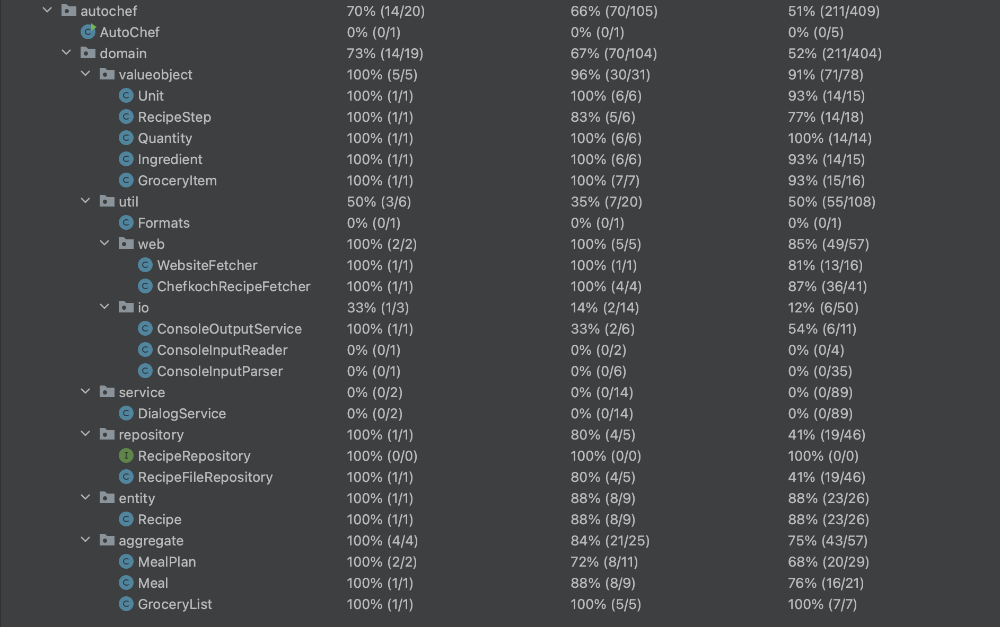

# Programmentwurf - AutoChef

Name: Schirmer, Oliver \
Martrikelnummer: XXX

Name: Müller, Luca \
Martrikelnummer: XXX

Abgabedatum: 28. Mai 2023

## Allgemeine Anmerkungen

- es darf nicht auf andere Kapitel als Leistungsnachweis verwiesen werden (z.B. in der Form “XY wurde schon in Kapitel 2 behandelt, daher hier keine Ausführung”)
- alles muss in UTF-8 codiert sein (Text und Code)
- sollten mündliche Aussagen den schriftlichen Aufgaben widersprechen, gelten die schriftlichen Aufgaben (ggf. an Anpassung der schriftlichen Aufgaben erinnern!)
- alles muss ins Repository (Code, Ausarbeitung und alles was damit zusammenhängt)
- die Beispiele sollten wenn möglich vom aktuellen Stand genommen werden
  - finden sich dort keine entsprechenden Beispiele, dürfen auch ältere Commits unter Verweis auf den Commit verwendet werden
  - Ausnahme: beim Kapitel “Refactoring” darf von vorne herein aus allen Ständen frei gewählt werden (mit Verweis auf den entsprechenden Commit)
- falls verlangte Negativ-Beispiele nicht vorhanden sind, müssen entsprechend mehr Positiv-Beispiele gebracht werden
  - Achtung: werden im Code entsprechende Negativ-Beispiele gefunden, gibt es keine Punkte für die zusätzlichen Positiv-Beispiele
  - Beispiel: “Nennen Sie jeweils eine Klasse, die das SRP einhält bzw. verletzt.”
  - -> Antwort: Es gibt keine Klasse, die SRP verletzt, daher hier 2 Klassen, die SRP einhalten: [Klasse 1], [Klasse 2]
  - -> Bewertung: falls im Code tatsächlich keine Klasse das SRP verletzt: volle Punktzahl ODER falls im Code mind. eine Klasse SRP verletzt: halbe Punktzahl
- verlangte Positiv-Beispiele müssen gebracht werden
- Code-Beispiel = Code in das Dokument kopieren

## 1. Einführung

### Übersicht über die Applikation

AutoChef ist eine Anwendung zur einfachen und effizienten Verwaltung und Erstellung von Essensplänen, sowie dazugehöriger Einkaufslisten. Zugrunde liegt dabei eine Datenbank an Rezepten. Diese ist beliebig erweiterbar durch eine [Chefkoch](chefkoch.de)-Integration. Diese ermöglicht es, einen Link zu einem Rezept auf Chefkoch an die Anwendung zu übergeben, woraufhin diese das entsprechende Rezept herunterlädt und persistiert. Diese Datenbank an Rezepten, sowie jeweilige Rezept-Details, können jederzeit eingesehen werden. Hauptfunktion ist jedoch die Generierung von Essensplänen. Dafür kann der Nutzer einen Zeitraum, sowie die Anzahl an Personen je Mahlzeit angeben und die Anwendung generiert anhand der Rezept-Datenbank, einen zufälligen Essensplan. Für diesen Essensplan wird ebenfalls eine Einkaufsliste generiert, die an die Anzahl an Personen angepasst ist. Mit diesen Funktionalitäten ist es einfach möglich, seine Woche kulinarisch zu planen und die Einkaufliste für den Wocheneinkauf zu erstellen.

_[Was macht die Applikation, Wie funktioniert sie? Welches Problem löst sie/welchen Zweck hat sie?]_

### Wie startet man die Applikation?

Bei AutoChef handelt es sich um eine CLI-Anwendung, geschrieben in Java 19. Zum Starten wird daher lediglich ein Desktop-Rechner mit **Java 19 aufwärts** benötigt. Die Anwendung kann dann über ein Konsolenfenster mit dem Befehl `java -jar AutoChef.jar` gestartet werden.

_[Wie startet man die Applikation? Welche Voraussetzungen werden benötigt? Schritt-für-Schritt-Anleitung]_

### Wie testet man die Applikation?

Nach dem Start der Anwendung wird der Nutzer durch einen intuitiven Dialog-Prozess begrüßt und geleitet. Der Nutzer interagiert dabei mit der Anwendung mittels des Konsolenfensters. Über dieses werden sowohl Informationen ausgegeben, als auch Eingaben vom Nutzer eingeholt. Der Dialog-Prozess ist so gestaltet, dass der Nutzer in der Regel mehrere nummerierte Optionen zur Auswahl hat und nur die Nummer der gewünschten Option eingeben und mit Enter absenden muss. Für den Import von Rezepten muss der Nutzer sich zuvor ein Rezept von Chefkoch aussuchen und im entsprechenden Dialog-Prozess-Schritt den dazugehörigen Link einfügen. Zu Beginn der Nutzung ist die Rezept-Datenbank noch leer, weshalb es sich anbietet anfangs ein paar Rezepte zu importieren. Erst danach können die Funktionen der Rezept-Anzeige und Essensplan-Generierung sinnvoll genutzt werden.

Hinweis: Zur Persistierung der Rezepte erstellt die Anwendung im aktuellen Arbeitsverzeichnis (des Konsolenfensters) einen `recipes`-Ordner. Falls der Nutzer keine Rechte hat im aktuellen Arbeitsverzeichnis Ordner & Dateien zu erstellen, sowie in diese zu schreiben, kann das Programm nicht ordnungsgemäß arbeiten und terminiert. Versuche in dem Fall die Anwendung mit erhöhten Berechtigungen zu starten oder in einem Arbeitsverzeichnis mit Schreibzugriff auszuführen.

_[Wie testet man die Applikation? Welche Voraussetzungen werden benötigt? Schritt-für-Schritt-Anleitung]_

## 2. Clean Architecture

### Was ist Clean Architecture?

Clean Architecture ist eine Architektur- und Designphilosophie, die darauf abzielt, komplexe Softwaresysteme in leicht verständliche, wartbare und erweiterbare Komponenten zu unterteilen. Es wurde von Robert C. Martin entwickelt und basiert auf den SOLID-Prinzipien.

Im Wesentlichen sieht Clean Architecture vor, dass eine Software in mehrere Schichten unterteilt wird, wobei jede Schicht eine klare Abhängigkeitshierarchie aufweist und nur von der nächstgelegenen Schicht abhängt. Die äußerste Schicht ist die Benutzerschnittstelle, die direkt mit dem Benutzer interagiert, gefolgt von einer oder mehreren Schichten mit Geschäftslogik, Datenzugriff und Infrastruktur.

Durch diese Aufteilung kann jede Schicht unabhängig von den anderen Schichten getestet und gewartet werden, was zu einer höheren Flexibilität und Skalierbarkeit des gesamten Systems führt. Darüber hinaus ist es einfacher, Änderungen an einem Teil des Systems vorzunehmen, ohne Auswirkungen auf den Rest des Systems zu haben.

Clean Architecture ermutigt auch zur Verwendung von Schnittstellen, um die Abhängigkeiten zwischen den Komponenten zu minimieren. Durch die Verwendung von Schnittstellen können verschiedene Implementierungen ausgetauscht werden, ohne dass dies Auswirkungen auf den Rest des Systems hat.

Zusammenfassend lässt sich sagen, dass Clean Architecture eine Methode ist, um große, komplexe Softwaresysteme in einfachere, leichter zu wartende Komponenten aufzuteilen, indem eine klare Abhängigkeitshierarchie zwischen den Komponenten eingeführt wird.

_[allgemeine Beschreibung der Clean Architecture in eigenen Worten]_

### Analyse der Dependency Rule

_[(1 Klasse, die die Dependency Rule einhält und eine Klasse, die die Dependency Rule verletzt); jeweils UML der Klasse und Analyse der Abhängigkeiten in beide Richtungen (d.h., von wem hängt die Klasse ab und wer hängt von der Klasse ab) in Bezug auf die Dependency Rule]_

#### Positiv-Beispiel: Dependency Rule


#### Negativ-Beispiel: Dependency Rule


### Analyse der Schichten

[//]: # (#### Plugins)
[//]: # (- ConsoleInputReader, ConsoleOutputService)


#### Schicht: Domain Code

- gewählte Klasse(n): `Recipe`


Die `Recipe`-Klasse ist eine Entity im Sinne der Clean-Architecture, da sie die Entität eines Rezeptes abbildet. Ein Rezept besteht aus folgenden Attributen:
- `name: String`: Name des Rezeptes
- `groceryList: GroceryList` : Liste an Zutaten, die für das Rezept benötigt werden
- `recipeSteps: List<RecipeStep>`: Liste an Zubereitungsschritten, die im Laufe des Rezeptes abgearbeitet werden müssen

Ein Rezept wird eineindeutig über eine ID indetifiziert. Die ID umfasst den Namen in Kleinschrift. Außerdem existieren für die Attribute und die ID jeweils Getter-Methoden und ein Konstruktor.

Damit liegt die Aufgabe der `Recipe`-Entität darin, ein Rezept semantisch im Code zu repräsentieren. Da das Konzept eines Rezept essenziell für die Domäne von Essensplänen ist, wurde es als Teil des Kernes der Anwendung aufgenommen. `Recipe` ist deshalb Teil der Schicht "Domain Code", da der Domänencode ebenjene Entities bzw den Kern der Anwendung enthalten sollte. Außerdem ändert sich die Modellierung eines Rezeptes selten, was ebenso dafür spricht, es in die Schicht "Domain Code" einzuordnen. 

#### Schicht: Application Code

- gewählte Klasse(n): `DialogService` mit `DialogState` 

[//]: # (mit `RecipeRepository`, `RecipeFileRepository` und `DialogState`)


Die Schicht des Applications Codes umfasst mehrere Klassen. Dabei soll die Klasse `DialogService` im Fokus stehen. 

[//]: # (Da dieser Service aber Abhängigkeiten zu anderen Klassen hat, die relevant in der Betrachtung und Einordnung sind, werden sie hier mit aufgeführt.)

Im Kern ist der Dialog-Service für die Ablauflogik der Anwendung verantwortlich. Er verwaltet die Datenpersistenz über die Klassen `RecipeRepository` und `RecipeFileRepository`, ist aber gleichzeitig auch für die Nutzung von Benutzereingaben über die Klassen `ConsoleInputReader`, `ConsoleInputParser` und `ConsoleOutputService` verantwortlich. Damit ist er die Schnittstelle zwischen den einzelnen Verantwortungsbereichen der Anwendung.

Im Allgemeinen startet er den Dialog mit dem Benutzer, organisiert die Generierung von Essensplänen und gibt dem Benutzer die Möglichkeit Rezepte hinzuzufügen. In diesem Sinne nimmt er die Rolle eines "Controllers" ein. Für andere Anwendungen wie etwa eine Web-Anwendung würde eine andere Funktionalität erwartet werden. Der Dialog-Service ist speziell für den Anwendungsfall einer CLI-Anwendung definiert und nutzbar. 

Ebenso bedeutet das, dass Änderungen an dem DialogService keinen Einfluss auf den Domänen-Code haben. All diese Aspekte begründen, warum der Dialog-Service im Application Code angesidelt ist. 

## 3. SOLID

### Analyse Single-Responsibility-Principle (SRP)

_[jeweils eine Klasse als positives und negatives Beispiel für SRP; jeweils UML der Klasse und Beschreibung der Aufgabe bzw. der Aufgaben und möglicher Lösungsweg des Negativ-Beispiels (inkl. UML)]_

#### Positiv-Beispiel


#### Negativ-Beispiel


### Analyse Open-Closed-Principle (OCP)

_[jeweils eine Klasse als positives und negatives Beispiel für OCP; jeweils UML der Klasse und Analyse mit Begründung, warum das OCP erfüllt/nicht erfüllt wurde – falls erfüllt: warum hier sinnvoll/welches Problem gab es? Falls nicht erfüllt: wie könnte man es lösen (inkl. UML)?]_

#### Positiv-Beispiel


#### Negativ-Beispiel


### Analyse Liskov-Substitution- (LSP), Interface-Segreggation- (ISP), Dependency-Inversion-Principle (DIP)

_[jeweils eine Klasse als positives und negatives Beispiel für entweder LSP oder ISP oder DIP); jeweils UML der Klasse und Begründung, warum man hier das Prinzip erfüllt/nicht erfüllt wird]_ \
_[Anm.: es darf nur ein Prinzip ausgewählt werden; es darf NICHT z.B. ein positives Beispiel für LSP und ein negatives Beispiel für ISP genommen werden]_

#### Positiv-Beispiel


#### Negativ-Beispiel


## 4. Weitere Prinzipien

### Analyse GRASP: Geringe Kopplung

_[jeweils eine bis jetzt noch nicht behandelte Klasse als positives und negatives Beispiel geringer Kopplung; jeweils UML Diagramm mit zusammenspielenden Klassen, Aufgabenbeschreibung und Begründung für die Umsetzung der geringen Kopplung bzw. Beschreibung, wie die Kopplung aufgelöst werden kann]_

#### Positiv-Beispiel


#### Negativ-Beispiel


### Analyse GRASP: Hohe Kohäsion

\*[eine Klasse als positives Beispiel hoher Kohäsion; UML Diagramm und Begründung, warum die Kohäsion hoch ist]


### Don’t Repeat Yourself (DRY)\*
Commit-SHA: d89dcb3 ([Link](https://github.com/ncryptedV1/AutoChef/commit/d89dcb38a0e45759dd3e689593870d1e9ed0da96))

vorher:

```java
  public MealPlan(List<Meal> meals, LocalDate start, LocalDate end) {
    int days = start.until(end).getDays();
    if (meals.size() != days) {
      throw new IllegalArgumentException(
        "Mahlzeiten-Plan spannt " + days + " Tage, es wurden allerdings nur " + meals.size()
          + " Mahlzeiten übergeben");
    }

    this.meals = meals;
    this.start = start;
    this.end = end;
  }

  // ...

  public int getDays() {
    return start.until(getEnd()).getDays();
  }
```

danach:

```java
  public MealPlan(List<Meal> meals, LocalDate start, LocalDate end) {
    this.start = start;
    this.end = end;

    int days = getDays();
    if (meals.size() != days) {
      throw new IllegalArgumentException(
          "Mahlzeiten-Plan spannt " + days + " Tage, es wurden allerdings nur " + meals.size()
              + " Mahlzeiten übergeben");
    }

    this.meals = meals;
  }

  // ...
  
  public int getDays() {
    return start.until(getEnd()).getDays();
  }
```

Die oben gezeigte Änderung ist ein kleines Beispiel zur Reduktion von Code-Duplikationen. Die Methode `getDays` ware bereits vor dem Commit vorhanden. Sie dient dazu, die Anzahl an Tagen zwischen `start` und `end` zu berechnen. Vor dem Commit, wurde jedoch dieselbe Logik im Konstruktor in der 2. Zeile verwendet: 

```java
int days = start.until(end).getDays();
```

Der Commit sorgte dafür, dass dieser Code durch einen Aufruf der `getDays` Methode ersetzt wurde. Das hat zur Folge, dass die Logik der Berechnung der Anzahl der Tage nur an einem Punkt im Code genutzt wird: in der `getDays` Methode. Dadurch können Fehler vermieden werden, die durch unachtsame Änderungen an einer der beiden Code-Stellen aufgetreten wären. 

## 5. Unit Tests

### 10 Unit Tests

_[Nennung von 10 Unit-Tests und Beschreibung, was getestet wird]_
| Unit Test                                         | Beschreibung                                                                                                                                     |
|---------------------------------------------------|--------------------------------------------------------------------------------------------------------------------------------------------------|
| _TestUnit#testHashCodeTrue_                       | testet, ob die `hashCode` Funktion der `Unit` Klasse, für zwei Objekte, den selben Hashcode korrekt zurückgibt zurückgibt                        |
| _TestUnit#testEqualsResSame_                      | testet, ob die `equals` Methode der `Unit` Klasse zwei Unit Instanzen mit dem selben `value` als korrekt gleich vergleicht                       |
| _TestQuantity#testConstructorException_           | testet, ob der Konstruktur der `Quantity` Klasse fehlschlägt, sobald negative (invalide) Werte übergeben werden                                  |
| _TestQuantity#testMultiply_                       | testet, ob die `multiply` Methode der `Quantity` Klasse den Wert korrekt multipliziert                                                           |
| _TestGroceryItem#testEqualsResSelf_               | testet, ob die `equals` Methode der `GroceryItem` Klasse zwei Objekte mit dem selben `value` als gleich ansieht                                  |
| _TestWebsiteFetcher#testGetWebsiteBodyInvalidUrl_ | testet, ob die `testGetWebsiteBodyInvalidUrl` Methode der `WebsiteFetcher` Klasse eine Exception wirft bei einer invaliden URL                   |
| _TestChefkochRecipeFetcher#testGetRecipe_         | testet, ob die `testGetRecipe` Methode der `ChefkochRecipeFetcher` Klasse die richtigen Inhalte für ein Chefkoch-Rezept aus dem Internet liefert |
| _TestRecipe#testConstructorHappyPath_             | testet, ob der Konstrutor der `Recipe` Klasse nicht `null` zurückgibt                                                                            |
| _TestMeal#testGetGroceryList_                     | testet, ob die `getGroceryList` Methode der `Meal` Klasse eine korrekt aggregierte Zutatenliste zurückgibt                                       |
| _TestGroceryList#testAddItem_                     | testet, ob die `addItem` Methode der `GroceryList` Klasse korrekt eine Itme zur GroceryList hinzufügt                                            |

### ATRIP: Automatic
Die Tests wurden mittels Testautomatisierung realisiert. Dabei wurde JUnit 5 verwendet, um automatisierte Tests zu schreiben. Über die IDE IntelliJ IDEA können die Test simpel über einen Knopfdruck ausgeführt werden. Im Anschluss laufen alle Tests automatisch. Das Ergebnis der Testautomatisierung zeigt, ob ein individueller Test erfolgreich (bestanden) oder nicht erfolgreich (fehlgeschlagen) war.

### ATRIP: Thorough

_[jeweils 1 positives und negatives Beispiel zu ‘Thorough’; jeweils Code-Beispiel, Analyse und Begründung, was professionell/nicht professionell ist]_

#### positives Beispiel

Test-Klasse: `TestIngredient`

```java
  @Test
  void testEqualsResSelf() {
    // arrange
    Ingredient ingredient1 = mock(Ingredient.class);

    // act
    boolean res = ingredient1.equals(ingredient1);

    // assert
    assertTrue(res);
  }

  @Test
  void testEqualsResSame() {
    // arrange
    String value = "banana";
    Ingredient ingredient1 = new Ingredient(value);
    Ingredient ingredient2 = new Ingredient(value);

    // act
    boolean res = ingredient1.equals(ingredient2);

    // assert
    assertTrue(res);
  }

  @Test
  void testEqualsDifferent() {
    // arrange
    Ingredient ingredient1 = new Ingredient("banana");
    Ingredient ingredient2 = new Ingredient("nutella");

    // act
    boolean res = ingredient1.equals(ingredient2);

    // assert
    assertFalse(res);
  }

  @Test
  void testEqualsNull() {
    // arrange
    Ingredient ingredient1 = mock(Ingredient.class);

    // act
    boolean res = ingredient1.equals(null);

    // assert
    assertFalse(res);
  }

  @Test
  void testHashCodeTrue() {
    // arrange
    String value = "banana";
    Ingredient ingredient1 = new Ingredient(value);
    Ingredient ingredient2 = new Ingredient(value);
  
    // act
    int code1 = ingredient1.hashCode();
    int code2 = ingredient2.hashCode();
  
    // assert
    assertEquals(code1, code2);
  }

  @Test
  void testHashCodeFalse() {
    // arrange
    Ingredient ingredient1 = new Ingredient("banana");
    Ingredient ingredient2 = new Ingredient("nutella");
  
    // act
    int code1 = ingredient1.hashCode();
    int code2 = ingredient2.hashCode();
  
    // assert
    assertNotEquals(code1, code2);
  }
```

Diese Testklasse mit den dargestellten Methoden ist ein Positivbeispiel für "thorough testing". All diese Testmethoden testen verschiedene Zweige der selbstimplementieren `equals` Methode der Klasse `Ingredient`. Sie testen Vergeliche zwischen
- einer `Ingredient`-Instanz mit sich selbst
- zwei gleichen `Ingredient`-Instanzen
- zwei verschiedenen `Ingredient`-Instanzen
- `null` und einer `Ingredient`-Instanz

Damit sind alle relevanten Pfade der `equals` Methode abgedeckt. Außerdem wird auch die Umgebung getestet. Da die `equals` Methode, auf die `hashcode` Methode zugreift, können Fehler in der `equals` Methode auf Fehler in der dortigen zurückgeführt werden. Demnentsprechend müssen auch alle relevanten Pfade der `hashcode` Methode getestet werden, was hier gemacht wird.

#### negatives Beispiel
zu testende Methode: `DialogService#startMealPlanGeneration`

```java
  private void startMealPlanGeneration() {
    currentState = DialogState.MEAL_PLAN_GENERATION;

    ConsoleOutputService.rawOut("Wir generieren jetzt zusammen einen Mahlzeiten-Plan. :D");
    LocalDate startDate = ConsoleInputParser.getDate(null, null,
      "Wann soll der Plan beginnen? (DD.MM.YYYY)");
    LocalDate endDate = ConsoleInputParser.getDate(startDate, null,
      "Bis wann soll der Plan gehen (exklusiv)? (DD.MM.YYYY)");
    int people = ConsoleInputParser.getInteger(1, 99,
      "Für wie viele Leute soll der Plan generiert werden?");
    int days = startDate.until(endDate).getDays();
    ConsoleOutputService.rawOut("Ok, ich generiere einen Plan für " + days + " Tage...");

    List<Recipe> recipes = recipeRepository.getRecipes();
    List<Meal> meals = new ArrayList<>();
    for (int i = 0; i < days; i++) {
      meals.add(new Meal(recipes.get(random.nextInt(recipes.size())), people));
    }

    MealPlan mealPlan = new MealPlan(meals, startDate, endDate);

    startPostMealPlanGeneration(mealPlan, recipes);
  }
```

Die hier gezeigt Methode `DialogService#startMealPlanGeneration` wurde nicht getestet, obwohl es möglich wäre dies zu tun. Damit stellt sie ein Negativbeispiel für die "thorough testing" dar. Der gezeigt Code startet die Generierung einer Essensplans. Dazu werden verschiedene Nutzereingaben abgefordert, z.B. Start und Enddatum, Anzahl der Personen. Im Anschluss werden die Rezepte geladen und mit einer zufälligen Teilmenge wird der Essensplan erstellt. Der Essensplan und die liste an Rezepten werden im Anschluss an eine weitere Methode weitergegeben.

Da die Tests für diese Methode vollständig fehlen, werden dementsprechend auch alle Pfade nicht getestet. Dementsprechend kann nicht herausgefunden werden, wo sich logische Fehler befinden. 

### ATRIP: Professional

#### positives Beispiel

Test-Methode: `TestWebsiteFetcher#testGetWebsiteBodyInvalidUrl`

```java
  @Test
  public void testGetWebsiteBodyInvalidUrl() {
    // Given
    String invalidUrl = "any string";

    // When and Then
    assertThrows(IllegalArgumentException.class, () -> WebsiteFetcher.getWebsiteBody(invalidUrl));
  }
```

Diese Testmethode testet die `getWebsiteBody` Methode der `WebsiteFetcher` Klasse. Hierbei wird ein String, der eine invalide URL darstellt, in die zu testende Funktion übergeben. Anschließend wird die `getWebsiteBody` Methode aufgerufen und überprüft, ob die richtige Exception geworfen wird. 

Diese Testmethode ist ein Positivbeispiel für professionelle Testklassen aus mehreren Gründen:
1. Der Name der Testmethode beschreibt gut, was genau getestet wird. In diesem Fall die `getWebsiteBody` Methode bei Eingabe einer invaliden URL.
2. Die zugehörige Klasse wurde nur zu Testzwecken angelegt.
3. Im Gegensatz zu Getter- oder Setter-Methoden existiert Logik, die getestetet werden sollte. Ein Test ist dementsprechend notwendig


#### negatives Beispiel
Test-Methode: `TestUnit#getValue`

```java
  @Test
  void testGetValue() {
    // arrange
    String expected = "piece";
    Unit unit = new Unit(expected);

    // act
    String res = unit.getValue();

    // assert
    assertEquals(expected, res);
  }
```

Diese Testmethode testet die `getValue` Getter-Methode der `Unit` Klasse. Dabei wird ein `Unit` ValueObject angelegt mit einem initialen Wert. Das Ergebnis der `getValue` wird verglichen mit dem initialen Wert. Beide Werten sollten gleich sein.  

Diese Klasse ist ein Negativbeispiel, da sie einen unnötigen Test darstellt. Getter Methoden sollten nicht getestet werden. Des Weiteren enthält diese Methode keine komplexe Logik, die ein Testen erfordern würde. Es handelt sich hier um einen Test, "der nur wegen des Tests geschrieben wurde". Außerdem ist der Dokumentationswert der Methode nicht vorhanden.

### Code Coverage

Die folgende Tabelle zeigt die summierten Werte der verschiedenen Arten von Testabdeckung des Projektes. Eine aufgeschlüsselte Version der Testabdeckung ist im folgenden Bild zu sehen. Die Prozentangaben des Bildes folgen derselben Reihenfolge wie in der Tabelle aufgelistet. 

| Art             | %  |
|-----------------|----|
| Class-Coverage  | 70 |
| Method-Coverage | 66 |
| Line-Coverage   | 51 |



Im Allgemeinen bestand das Ziel, die Testabdeckung so hoch wie möglich zu halten. Deshalb wurden weitesgehend alle Klassen automatisiert getestet, jedoch nicht alle. Das hat vor allem den Grund, dass die automatisierte Testung für einige Klassen unserer Ansicht nicht sinnhaft war. Beispiele hierfür sind:

- `domain.util.Formats`: Diese Klasse dient lediglich als Format-Klasse ohne weitere Logik. 
- `domain.util.io.ConsoleOutputService`: Da es sich hier vor allem um die Formattierung von Konsolenausgaben handelt, wurden hier die Tests ebenso vernachlässigt.

Unabhängig dessen begründet sich die Code-Coverage wie folgt:
- Class-Coverage: die Mehrheit der Klassen weist Tests auf, weshalb der Wert hier mit 70% vergleichsweise hoch liegt. 
- Method-Coverage: Aus genannten Gründen wurden eine Reihe von Methoden nicht getestet, daher liegt die Method-Coverage unter der Class-Coverage.
- Line-Coverage: Die Line-Coverage ist durch die Method-Coverage bedingt und ist deshalb vor allem aus demselbigen Grund niedriger.

### Fakes und Mocks

In diesem Projekt wurden vor allem Mock-Objekte eingesetzt. Sie wurden genutzt, um benötigte Nebenklassen zu mocken. Nachfolgend sind zwei demonstrative Beispiel für den Einsatz von Mock-Objekten mit dazugehörigen UML Diagrammen zu sehen. 

Beispiel aus: `TestGroceryList#testConstructorVarArgs`

```java
  @Test
  public void testConstructorVarArgs() {
    // arrange
    GroceryItem item1 = mock(GroceryItem.class);
    GroceryItem item2 = mock(GroceryItem.class);

    // act
    GroceryList list = new GroceryList(item1, item2);

    // assert
    assertNotNull(list);
  }
```


_[TODO: Analyse und Begründung für Einsatz]


Beispiel aus: `TestMealPlan#setUp`

```java
  @BeforeEach
  public void setUp() {
    start = LocalDate.now();
    end = start.plusDays(5);
    int totalMeals = start.until(end).getDays();

    List<Meal> meals = new ArrayList<>();
    for (int i = 0; i < totalMeals; i++) {
    meals.add(mock(Meal.class));
    }

    mealPlan = new MealPlan(meals, start, end);
  }
```


_[TODO: Analyse und Begründung für Einsatz]

_[Analyse und Begründung des Einsatzes von 2 Fake/Mock-Objekten; zusätzlich jeweils UML Diagramm der Klasse]_


## 6. Domain Driven Design

### Ubiquitous Language

_[4 Beispiele für die Ubiquitous Language; jeweils Bezeichung, Bedeutung und kurze Begründung, warum es zur Ubiquitous Language gehört]_
| Bezeichnung  | Bedeutung                     | Begründung                                                                                                                          |
|--------------|-------------------------------|-------------------------------------------------------------------------------------------------------------------------------------|
| Ingredient   | Zutat                         | Jedes Gericht besteht aus verschiedenen Lebensmitteln sogenannten Zutaten.                                                          |
| Grocery item | Element der Lebensmittelliste | Ein Gericht braucht Zutaten in bestimmten Mengen. Lebensmittel auf der Lebensmittelliste sind in Menge und Einheit daran angepasst. |
| Grocery list | Lebensmittelliste             | Für Gerichte werden eine Menge von Lebensmittel benötigt. Die Lebensmittelliste fasst all diese zusammen.                           |
| Meal plan    | Essensplan                    | Ein Essensplan beschreibt eine Sammlung von Gerichten für einen bestimmten Zeitraum.                                                |

### Entities

zugehörige Klassen(n): `Recipe`


Die `Recipe` Entity beschreibt ein semantisches Rezept. Wie das UML-Diagram zeigt, besteht ein Rezept aus einem Name, einer Liste von Zutaten (GroceryList) und einer Liste von Schritten zur Zubereitung (RecipeStep). Ein Rezept wird eineindeutig über eine ID indetifiziert. In diesem Fall besteht die ID aus dem Namen in Kleinschrift. Haben also zwei Rezepte den selben Namen, werden sie als gleich angesehen. Weiterhin hat die `Recipe` Klasse mehrere Getter-Methoden für die einzelnen Attribute und die ID als auch einen Konstruktor.

Bei der Erstellung einer `Recipe`-Instanz mittels des Konstruktors wird die Richtigkeit der Attribute überprüft:
- Der Name muss mindestens ein Zeichen abgesehen von White-Space beinhalten.
- Die `RecipeStep`-Instanzen der Liste müssen in der richtigen Reihenfolge und konsektutiv vollständig sein, d.h. es dürfen keine Schritten zwischendrin fehlen.

Der Einsatz dieser Entity begründet sich dadurch, dass es notwendig war, ein Rezept abbilden zu können. Rezepte werden gespeichert und haben somit einen Lebenszyklus. Das erzwingt laut Domain Driven Design Richtlinien die Erstellung einer Entity.

### Value Objects

zugehörige Klassen(n): `Ingredient`


Das `Ingredient` Value Object beschreibt eine Zutat für ein Gericht. Es besitzt als einziges Attribute einen Namen, der es definiert. Neben dem Namen besitzt es zwei Getter-Methoden für den Namen (`getValue`) und für die ID (`getID`). Letztere, ist dabei jedoch nicht zur eindeutigen Identifizierung im Sinne einer Entity anzusehen, sondern wird lediglich zum einfacheren Vergleich zweier `Ingredient`-Instanzen verwendet. Die ID setzt sich aus dem Namen in Kleinschrift zusammen. Zusätzlich existiert ein Konstruktor zur Erzeugung einer Ingredient-Instanz, bei der die Richtigkeit des Namens überprüft wird. Ähnlich wie bei der `Recipe`-Klassen, muss ein Namen mindestens ein Zeichen enthalten, das keinem White-Space Zeichen entspricht. 

Ein `Ingredient` hat keinen Lebenszyklus und auch keine relevante Logik implementiert. Es dient lediglich zur Repräsentation von Informationen. Aus diesem Grund ist es auch nicht möglich die Informationen einer `Ingredient`-Instanz anzupassen - sie sind konstant. All diese Punkte begründen, warum sich hier für ein Value Object anstelle einer Entity oder Ähnlichem entschieden wurde.

### Repositories

zugehörige Klassen(n): `RecipeFileRepository`


- `saveRecipe`: speichert ein gegebenes Rezept in einer Datei im Dateiort `recipesFolder` ab
Repositories dienen als Vermittler zwischen Datenmodell und Domänenlogik. Sie werden genutzt, um Daten zu speichern oder sie abzurufen aus ebendiesen Speicher. In diesem Projekt wurde ein Repository `RecipeFileRepository` genutzt, um die Persistenz von Rezepten zu verwalten. Das `RecipeFileRepository` besitzt als einziges Attribut eine Instanz der `File`-Klasse namens `recipesFolder`, die angibt, wo im Dateisystem Rezepte gespeichert werden sollten. Zusätzlich existieren Methoden zur Persistenzverwaltung, die von dem Interface `RecipeRepository` implementiert werden:
- `deleteRecipe`: löscht ein gegebenes Rezept im Dateiort `recipesFolder`
- `getRecipe`: liest ein anhand der ID definiertes Rezept im Dateiort `recipesFolder` ein
- `getRecipes`: liest alle vorhandenen Rezepte im Dateiort `recipesFolder` ein

Damit sind die relevanten Methoden der Persistenzverwaltung abgedeckt. Bei der Erstellung einer `RecipeFileRepository`-Instanz mittels des Konstruktors wird ebenso geprüft, ob ein Ordner im Pfad `recipesFolder` angelegt werden kann. Sollte das nicht der Fall sein, tritt ein Fehler auf und es kann keine Instanz angelegt werden. 

Um die Persistenzverwaltung gründlich und sauber von der Domänenlogik zu trennen, wurde dieses Repository eingesetzt. Mit Nutzung des Interfaces, kann sichergestellt werden, dass beide Elemente getrennt bleiben. Zusätzlich ermöglicht der Einsatz eines Repositories, Veränderungen an der Persistenzverwaltung vorzunehmen, ob auf die Domänenlogik eingreifen zu müsssen. 

### Aggregates

zugehörige Klassen(n): `Meal`


In diesem Projekt wurde die `Meal`-Klasse als Aggregate ausgewählt.Die `Meal`-Klasse fasst logsiches Verhalten verschiedener Elemente zusammen. Es definiert sich durch ein Rezept `recipe` und einem Integer `adjustedNumberOfPeople`, das darstellt, auf wie viele Personen die Zutatenmenge des Rezeptes angepasst werden soll. Der Konstruktor enthält keine weitere Logik zur Überprüfung der Attribute. Des Weiteren exisiteren folge Methoden:
- `getRecipe`: eine Getter-Methode für `recipe`
- `setRecipe`: eine Setter-Methode für `recipe`
- `getAdjustedNumberOfPeople`: eine Getter-Methode für `adjustedNumberOfPeople`
- `getGroceryList`: eine Getter-Methode, die die Zutaten des Rezeptes zurückgibt. Dabei werden die Mengen der Zutaten auf `adjustedNumberOfPeople` angepasst.

Damit fasst das `Meal`-Aggregate Logik eines Gerichtes zusammen. Es hält jedoch keine eigene Identität, da dies bereits durch `Recipe` erfolgt ist. Es dient lediglich als Wrapper für ein Rezept um jenes zu repräsentieren. In der Theorie wäre es möglich, der `Meal`-Klasse eine eigenständige Identität und Lebenszyklus zu verleihen und es damit zu einer Entity zu transferieren. Das wäre vor allem hilfreich, wenn Logik zur Persistierung von Gerichten implementiert werden sollte. Da das aber nicht im Umfang der Anwendung inbegriffen ist, ist ein Transfer zu einer Entity nicht notwendig. 

## 7. Refactoring

### Code Smells

_[jeweils 1 Code-Beispiel zu 2 Code Smells aus der Vorlesung; jeweils Code-Beispiel und einen möglichen Lösungsweg bzw. den genommen Lösungsweg beschreiben (inkl. (Pseudo-)Code)]_
#### Code Smell 1
https://github.com/ncryptedV1/AutoChef/commit/d89dcb38a0e45759dd3e689593870d1e9ed0da96
Duplicate Code


Large Method / Extract Class
https://github.com/ncryptedV1/AutoChef/commit/8a66d9a6405c9ca4cf710490ae06eb810ea87978#diff-a914343e6af07030cd7b3b51d56fc5e0f541d6bd350ee0ef11324a9bc5aae66f

Dead Code
https://github.com/ncryptedV1/AutoChef/commit/f2b13c5e535bf60d72c17d51970f2993bd3457cf


### 2 Refactorings

_[2 unterschiedliche Refactorings aus der Vorlesung anwenden, begründen, sowie UML vorher/nachher liefern; jeweils auf die Commits verweisen]_

#### Refactoring 1


#### Refactoring 2


## 8. Entwurfsmuster

_[2 unterschiedliche Entwurfsmuster aus der Vorlesung (oder nach Absprache auch andere) jeweils sinnvoll einsetzen, begründen und UML-Diagramm]_

#### Entwurfsmuster: [Name]


#### Entwurfsmuster: [Name]


